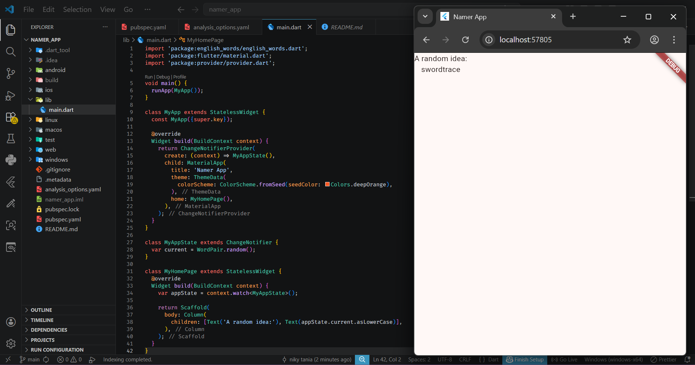
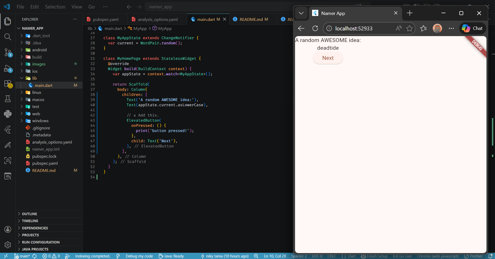
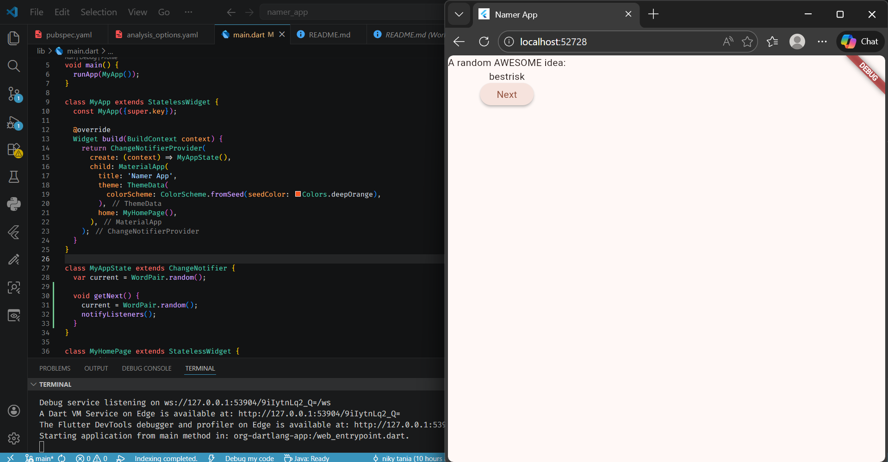
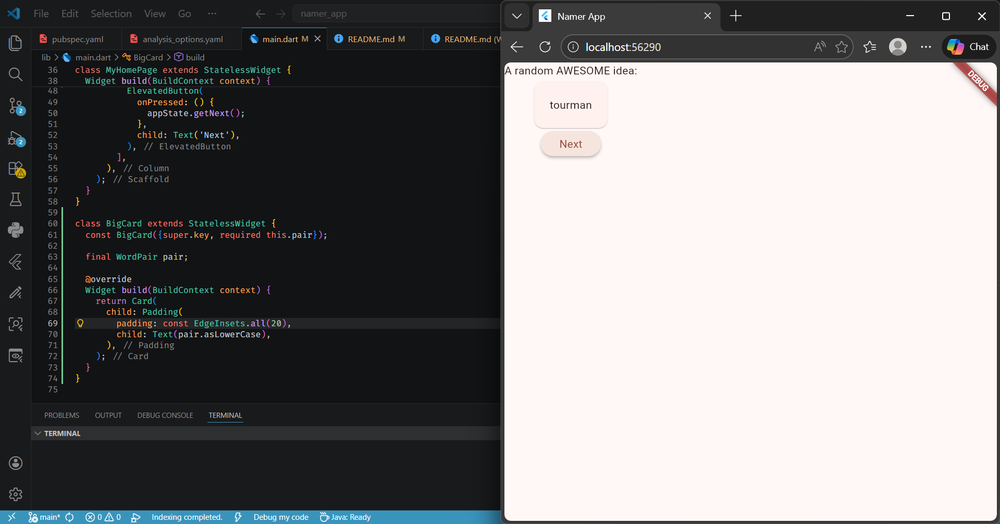
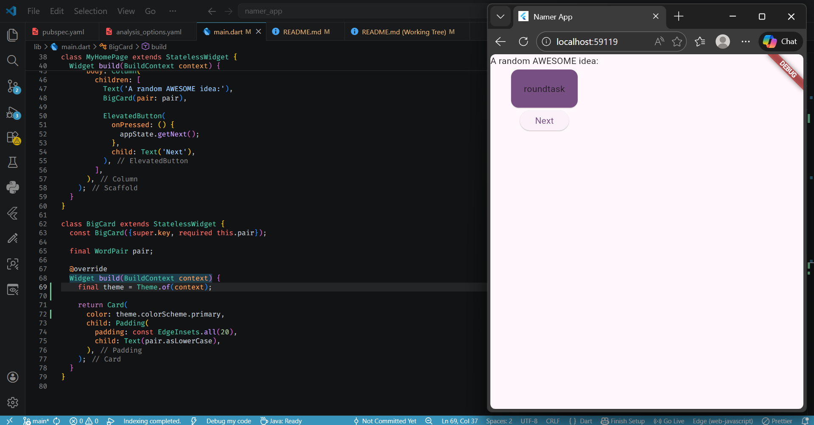
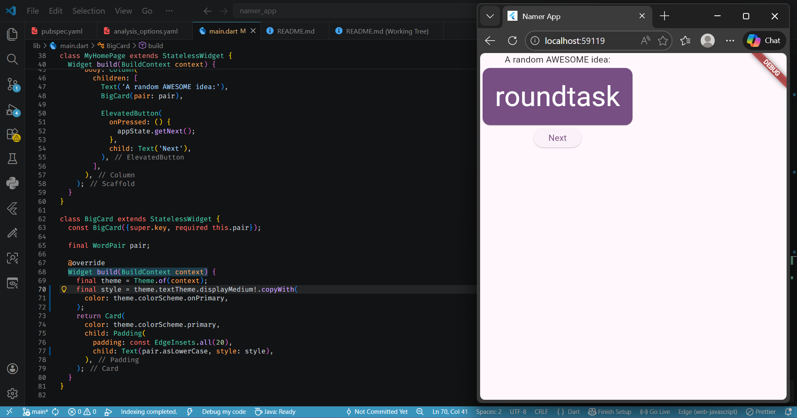
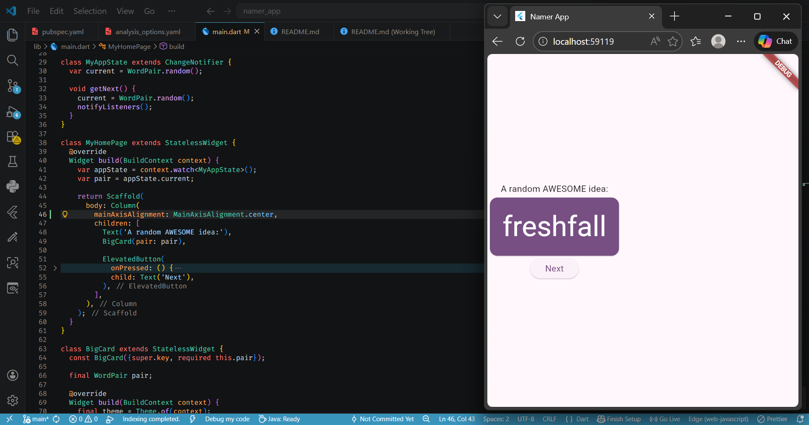
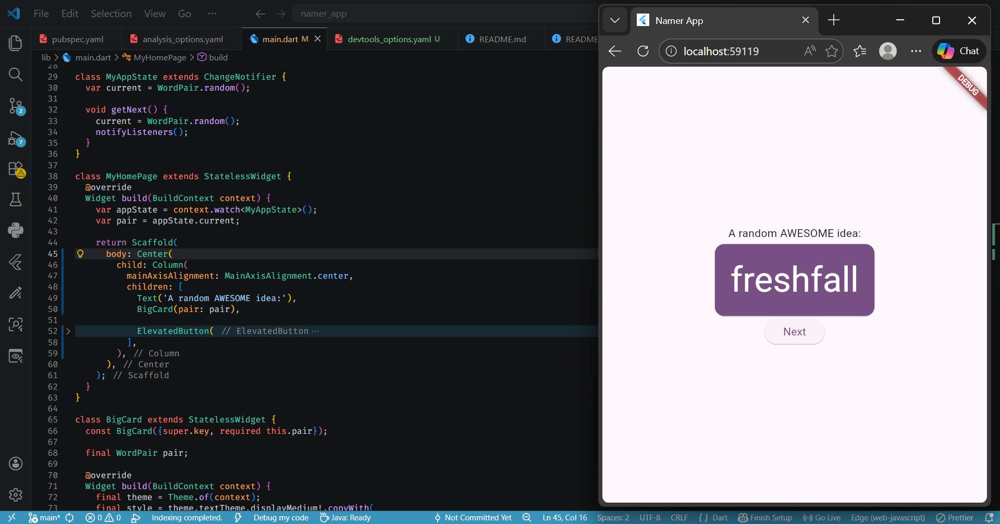
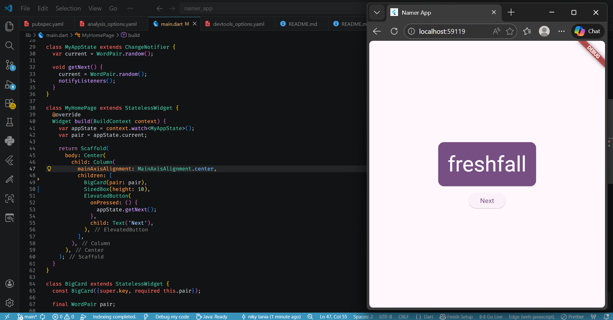

# namer_app

A new Flutter project.

## Getting Started

This project is a starting point for a Flutter application.

#4. Add a button

#4. Add a button - getNext method

#5. Make the app prettier - menggabungkan widget Padding, dan juga Text, dengan widget Card

#5. Make the app prettier - warna widget card

#5. Make the app prettier - tema font

#5. Make the app prettier - menempatkan UI di tengah

#5. Make the app prettier - UI center

#5. Make the app prettier - hapus teks

A few resources to get you started if this is your first Flutter project:

- [Learn Flutter](https://docs.flutter.dev/get-started/learn-flutter)
- [Write your first Flutter app](https://docs.flutter.dev/get-started/codelab)
- [Flutter learning resources](https://docs.flutter.dev/reference/learning-resources)

For help getting started with Flutter development, view the
[online documentation](https://docs.flutter.dev/), which offers tutorials,
samples, guidance on mobile development, and a full API reference.
