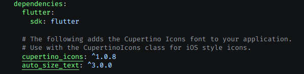
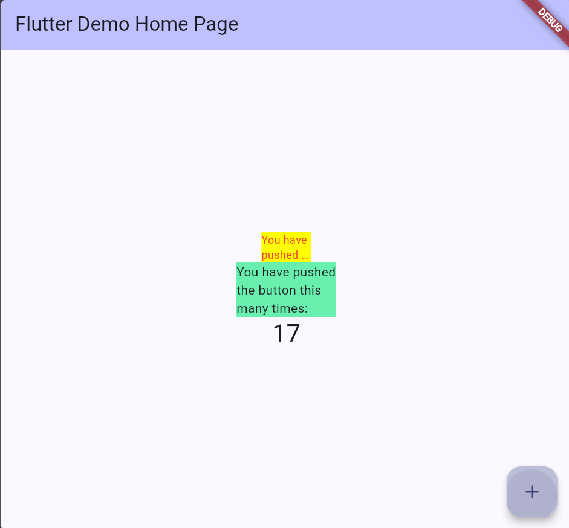

# flutter_plugin_pubdev

## 7. Praktikum Menerapkan Plugin di Project Flutter

### Langkah 1: Buat Project Baru
Membuat project Flutter baru dengan nama `flutter_plugin_pubdev` dan menjadikannya repository di GitHub.


### Langkah 2: Menambahkan Plugin
Menambahkan plugin `auto_size_text` menggunakan perintah berikut di terminal:

```bash
flutter pub add auto_size_text
```

Jika berhasil, maka akan tampil nama plugin beserta versinya di file `pubspec.yaml` pada bagian dependencies.

**Jawaban:** proses ini merupakan menambahkan plugin eksternal bernama `auto_size_text` ke dalam project Flutter. Perintah `flutter pub add auto_size_text` secara otomatis mengunduh plugin tersebut dari pub.dev dan mendaftarkannya di file `pubspec.yaml` pada bagian `dependencies`. Plugin ini berfungsi untuk membuat teks otomatis menyesuaikan ukurannya agar pas di dalam batas widget yang ditentukan




### Langkah 3: Buat file `red_text_widget.dart`
Membuat file baru bernama `red_text_widget.dart` di dalam folder `lib` dengan isi kode berikut:

```dart
import 'package:flutter/material.dart';

class RedTextWidget extends StatelessWidget {
  const RedTextWidget({Key? key}) : super(key: key);

  @override
  Widget build(BuildContext context) {
    return Container();
  }
}
```


### Langkah 4: Tambah Widget AutoSizeText
Masih di file `red_text_widget.dart`, untuk menggunakan plugin `auto_size_text`, 
ubahlah kode `return Container()` menjadi seperti berikut:

```dart
return AutoSizeText(
  text,
  style: const TextStyle(color: Colors.red, fontSize: 14),
  maxLines: 2,
  overflow: TextOverflow.ellipsis,
);
```

Setelah Anda menambahkan kode di atas, Anda akan mendapatkan info error. Mengapa demikian?

**Jawaban:** Error terjadi karena variabel `text` belum dideklarasikan sebagai parameter di class `RedTextWidget`, sehingga Flutter tidak mengenali variabel tersebut


### Langkah 5: Buat Variabel text dan parameter di constructor
Tambahkan variabel `text` dan parameter di constructor seperti berikut.

```dart
final String text;

const RedTextWidget({Key? key, required this.text}) : super(key: key);
```

Jelaskan maksud dari langkah 5 pada praktikum tersebut!

**Jawaban:** menambahkan variabel `text` bertipe `String` dan menjadikannya parameter wajib (`required`) di constructor class `RedTextWidget`. Hal ini diperlukan agar widget dapat menerima data teks dari luar (dari widget pemanggil), sehingga teks yang ditampilkan bisa berbeda-beda tergantung nilai yang dikirimkan


### Langkah 6: Tambahkan widget di main.dart
Buka file `main.dart` lalu tambahkan di dalam `children:` pada `class _MyHomePageState`:

```dart
Container(
  color: Colors.yellowAccent,
  width: 50,
  child: const RedTextWidget(
    text: 'You have pushed the button this many times:',
  ),
),
Container(
  color: Colors.greenAccent,
  width: 100,
  child: const Text(
    'You have pushed the button this many times:',
  ),
),
```

Pada langkah 6 terdapat dua widget yang ditambahkan, jelaskan fungsi dan perbedaannya!

**Jawaban:**

**Widget pertama** menggunakan `RedTextWidget` dengan lebar container 50 piksel dan warna kuning. Widget ini memakai `AutoSizeText` sehingga teks akan otomatis mengecil dan terpotong (`ellipsis`) jika tidak muat dalam lebar 50 piksel

**Widget kedua** menggunakan `Text` biasa dengan lebar container 100 piksel dan warna hijau. Widget ini tidak memiliki kemampuan auto resize, sehingga teks bisa melampaui keluar batas container jika terlalu panjang

**Perbedaan utamanya:** `RedTextWidget` (AutoSizeText) menyesuaikan ukuran font secara otomatis, sedangkan `Text` biasa tidak


Run aplikasi tersebut dengan tekan F5, maka hasilnya akan seperti berikut.




A few resources to get you started if this is your first Flutter project:

- [Learn Flutter](https://docs.flutter.dev/get-started/learn-flutter)
- [Write your first Flutter app](https://docs.flutter.dev/get-started/codelab)
- [Flutter learning resources](https://docs.flutter.dev/reference/learning-resources)

For help getting started with Flutter development, view the
[online documentation](https://docs.flutter.dev/), which offers tutorials,
samples, guidance on mobile development, and a full API reference.
