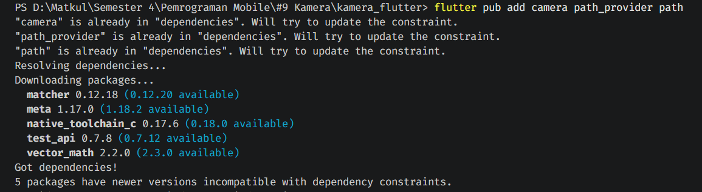
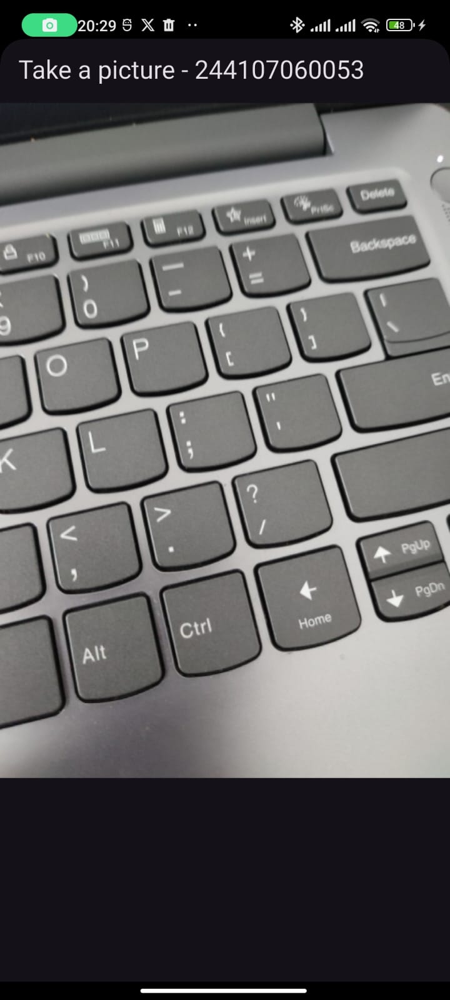
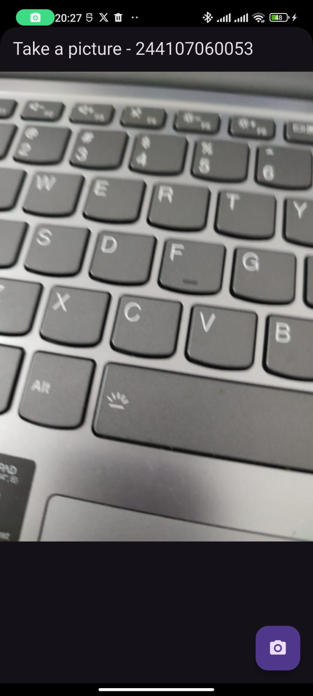
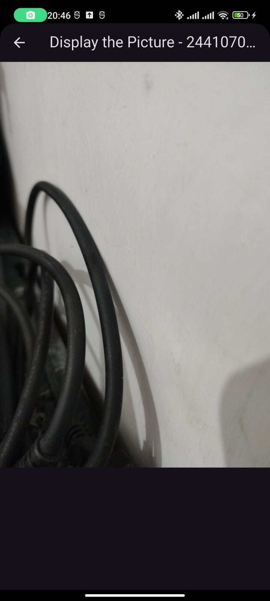

# kamera_flutter

## Praktikum 1: Mengambil Foto dengan Kamera di Flutter

### Langkah 1: Buat Project Baru
Membuat project Flutter baru dengan nama `kamera_flutter`.


### Langkah 2: Tambah dependensi yang diperlukan
Anda memerlukan tiga dependensi pada project flutter untuk menyelesaikan praktikum ini.

- `camera` → menyediakan seperangkat alat untuk bekerja dengan kamera pada device
- `path_provider` → menyediakan lokasi atau path untuk menyimpan hasil foto
- `path` → membuat path untuk mendukung berbagai platform


Untuk menambahkan dependensi plugin, jalankan perintah flutter pub add seperti berikut di terminal:

```bash
flutter pub add camera path_provider path
```

```dart
<key>NSCameraUsageDescription</key>
<string>Explanation on why the camera access is needed.</string>
<key>NSMicrophoneUsageDescription</key>
<string>Explanation on why the microphone access is needed.</string>
```




### Langkah 3: Ambil Sensor Kamera dari device
Selanjutnya, kita perlu mengecek jumlah kamera yang tersedia pada perangkat menggunakan plugin `camera` seperti pada kode berikut ini. Kode ini letakkan dalam `void main()`.


lib/main.dart

```dart
WidgetsFlutterBinding.ensureInitialized();
final cameras = await availableCameras();
final firstCamera = cameras.first;
```


Ubah `void main()` menjadi async function seperti berikut ini.

lib/main.dart

```dart
Future<void> main() async {
  ...
}
```


### Langkah 4: Buat dan inisialisasi CameraController

Setelah Anda dapat mengakses kamera, gunakan langkah-langkah berikut untuk membuat dan menginisialisasi `CameraController`. Pada langkah berikut ini, Anda akan membuat koneksi ke kamera perangkat yang memungkinkan Anda untuk mengontrol kamera dan menampilkan pratinjau umpan kamera.

1. Buat `StatefulWidget` dengan kelas `State` pendamping.
2. Tambahkan variabel ke kelas `State` untuk menyimpan `CameraController`.
3. Tambahkan variabel ke kelas `State` untuk menyimpan `Future` yang dikembalikan dari `CameraController.initialize()`.
4. Buat dan inisialisasi controller dalam metode `initState()`.
5. Hapus controller dalam metode `dispose()`.


lib/widget/takepicture_screen.dart

```dart
class TakePictureScreen extends StatefulWidget {
  const TakePictureScreen({
    super.key,
    required this.camera,
  });

  final CameraDescription camera;

  @override
  TakePictureScreenState createState() => TakePictureScreenState();
}

class TakePictureScreenState extends State<TakePictureScreen> {
  late CameraController _controller;
  late Future<void> _initializeControllerFuture;

  @override
  void initState() {
    super.initState();
    _controller = CameraController(
      widget.camera,
      ResolutionPreset.medium,
    );
    _initializeControllerFuture = _controller.initialize();
  }

  @override
  void dispose() {
    _controller.dispose();
    super.dispose();
  }

  @override
  Widget build(BuildContext context) {
    return Container();
  }
}
```


### Langkah 5: Gunakan `CameraPreview` untuk menampilkan preview foto

Gunakan widget `CameraPreview` dari package `camera` untuk menampilkan preview foto. Anda perlu tipe objek void berupa `FutureBuilder` untuk menangani proses async.


lib/widget/takepicture_screen.dart

```dart
@override
Widget build(BuildContext context) {
  return Scaffold(
    appBar: AppBar(title: const Text('Take a picture - NIM Anda')),
    body: FutureBuilder<void>(
      future: _initializeControllerFuture,
      builder: (context, snapshot) {
        if (snapshot.connectionState == ConnectionState.done) {
          return CameraPreview(_controller);
        } else {
          return const Center(child: CircularProgressIndicator());
        }
      },
    ),
  );
}
```




### Langkah 6: Ambil foto dengan CameraController

Anda dapat menggunakan `CameraController` untuk mengambil gambar menggunakan metode `takePicture()`, yang mengembalikan objek `XFile`, merupakan sebuah objek abstraksi `File` lintas platform yang disederhanakan. Pada Android dan iOS, gambar baru disimpan dalam direktori cache masing-masing, dan `path` ke lokasi tersebut dikembalikan dalam `XFile`.

Pada codelab ini, buatlah sebuah `FloatingActionButton` yang digunakan untuk mengambil gambar menggunakan `CameraController` saat pengguna mengetuk tombol.

Pengambilan gambar memerlukan 2 langkah:

1. Pastikan kamera telah diinisialisasi.
2. Gunakan controller untuk mengambil gambar dan pastikan ia mengembalikan objek `Future`.

Praktik baik untuk membungkus operasi kode ini dalam blok `try / catch` guna menangani berbagai kesalahan yang mungkin terjadi. 

Kode berikut letakkan dalam `Widget build` setelah field `body`.


lib/widget/takepicture_screen.dart

```dart
FloatingActionButton(
  onPressed: () async {
    try {
      await _initializeControllerFuture;
      final image = await _controller.takePicture();
    } catch (e) {
      print(e);
    }
  },
  child: const Icon(Icons.camera_alt),
)
```




### Langkah 7: Buat widget DisplayPictureScreen
Buatlah file baru pada folder widget yang berisi kode berikut.


lib/widget/displaypicture_screen.dart

```dart
class DisplayPictureScreen extends StatelessWidget {
  final String imagePath;

  const DisplayPictureScreen({super.key, required this.imagePath});

  @override
  Widget build(BuildContext context) {
    return Scaffold(
      appBar: AppBar(title: const Text('Display the Picture - NIM Anda')),
      body: Image.file(File(imagePath)),
    );
  }
}
```


### Langkah 8: Edit main.dart

Edit pada file ini bagian runApp seperti kode berikut.


lib/main.dart

```dart
runApp(
  MaterialApp(
    theme: ThemeData.dark(),
    home: TakePictureScreen(
      camera: firstCamera,
    ),
    debugShowCheckedModeBanner: false,
  ),
);
```


### Langkah 9: Menampilkan hasil foto

Tambahkan kode seperti berikut pada bagian `try / catch` agar dapat menampilkan hasil foto pada `DisplayPictureScreen`.


lib/widget/takepicture_screen.dart

```dart
try {
  await _initializeControllerFuture;
  final image = await _controller.takePicture();

  if (!context.mounted) return;

  await Navigator.of(context).push(
    MaterialPageRoute(
      builder: (context) => DisplayPictureScreen(
        imagePath: image.path,
      ),
    ),
  );
} catch (e) {
  print(e);
}
```




## Tugas Praktikum
1. Selesaikan Praktikum 1 dan 2, lalu dokumentasikan dan push ke repository Anda berupa screenshot setiap hasil pekerjaan beserta penjelasannya di file README.md! Jika terdapat error atau kode yang tidak dapat berjalan, silakan Anda perbaiki sesuai tujuan aplikasi dibuat!
2. Gabungkan hasil praktikum 1 dengan hasil praktikum 2 sehingga setelah melakukan pengambilan foto, dapat dibuat filter carouselnya!
3. Jelaskan maksud `void async` pada praktikum 1?
4. Jelaskan fungsi dari anotasi `@immutable` dan `@override` ?
5. Kumpulkan link commit repository GitHub Anda kepada dosen yang telah disepakati!


A few resources to get you started if this is your first Flutter project:

- [Learn Flutter](https://docs.flutter.dev/get-started/learn-flutter)
- [Write your first Flutter app](https://docs.flutter.dev/get-started/codelab)
- [Flutter learning resources](https://docs.flutter.dev/reference/learning-resources)

For help getting started with Flutter development, view the
[online documentation](https://docs.flutter.dev/), which offers tutorials,
samples, guidance on mobile development, and a full API reference.
